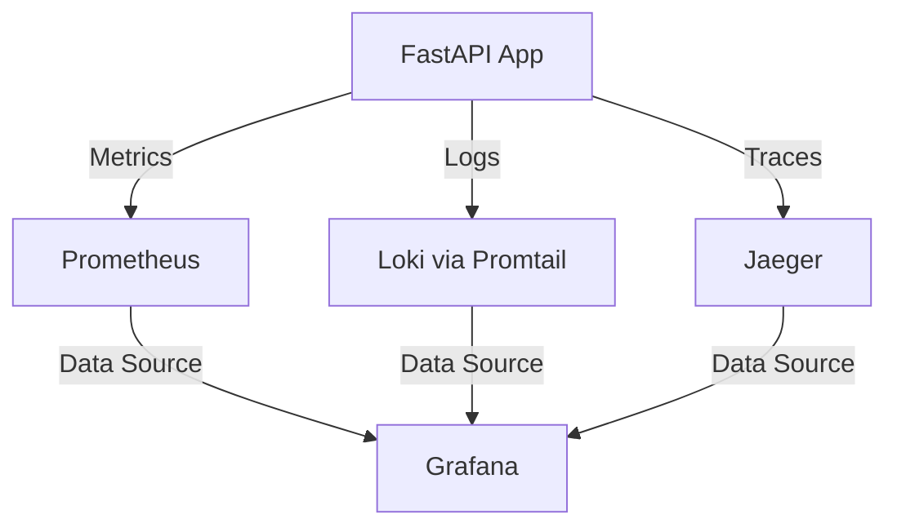

# FastAPI Monitoring Stack with Prometheus, Grafana, Loki, and Jaeger

A comprehensive monitoring solution for FastAPI applications, providing:
- **Metrics Collection** with Prometheus
- **Visualization** with Grafana
- **Log Aggregation** with Loki
- **Distributed Tracing** with Jaeger

## 📋 Table of Contents
- [Features](#-features)
- [Architecture](#-architecture)
- [Prerequisites](#-prerequisites)
- [🚀 Quick Start](#-quick-start)
- [📊 Monitoring Features](#-monitoring-features)
  - [Metrics Collection](#metrics-collection)
  - [Logging](#logging)
  - [Distributed Tracing](#distributed-tracing)
- [📂 Project Structure](#-project-structure)
- [🔧 Configuration](#-configuration)
  - [Environment Variables](#environment-variables)
  - [Port Configuration](#port-configuration)
- [🧪 Running Tests](#-running-tests)
- [🔍 Debugging](#-debugging)
- [📈 Performance Considerations](#-performance-considerations)
- [🤝 Contributing](#-contributing)
- [📄 License](#-license)

## ✨ Features

- **Real-time Metrics**: Monitor request rates, response times, and error rates
- **Centralized Logging**: Aggregate and search logs across all services
- **Distributed Tracing**: Track requests across service boundaries
- **Pre-configured Dashboards**: Ready-to-use Grafana dashboards
- **Scalable Architecture**: Containerized with Docker for easy deployment
- **Load Testing**: Built-in script to simulate traffic and test monitoring

## 🏗️ Architecture



## 🛠️ Prerequisites

- Docker 20.10.0+
- Docker Compose 1.29.0+
- Python 3.8+ (for running load tests)
- 4GB+ RAM recommended

## 🚀 Quick Start

1. **Clone the repository**
   ```bash
   git clone https://github.com/yourusername/fastapi-monitoring-assignment.git
   cd fastapi-monitoring-assignment
   ```

2. **Start the services**
   ```bash
   docker-compose up -d
   ```

3. **Access the services**:
   - 🌐 FastAPI Application: http://localhost:8000
   - 📊 Grafana: http://localhost:3000 (admin/admin)
   - 📈 Prometheus: http://localhost:9090
   - 🔍 Jaeger UI: http://localhost:16686

4. **Generate sample traffic** (optional):
   ```bash
   # Install requirements
   pip install -r app/requirements.txt
   
   # Run load test
   python load_test.py
   ```

## 📊 Monitoring Features

### Metrics Collection
- **Endpoints**:
  - `GET /metrics` - Prometheus metrics endpoint
  - `GET /health` - Health check endpoint

### Logging
- Structured JSON logging
- Log levels: INFO, WARNING, ERROR
- Logs are shipped to Loki via Promtail

### Distributed Tracing
- Traces requests across services
- Integrated with FastAPI middleware
- View traces in Jaeger UI

## 📂 Project Structure

```
fastapi-monitoring-assignment/
├── app/                    # FastAPI application
│   ├── Dockerfile          # Docker configuration
│   ├── requirements.txt    # Python dependencies
│   └── main.py            # Application code with instrumentation
├── prometheus/             
│   └── prometheus.yml     # Prometheus configuration
├── grafana/
│   └── provisioning/      # Grafana provisioning
│       └── datasources/   # Data source configurations
│           └── datasource.yml
├── promtail/
│   └── promtail-config.yml # Log shipping config
├── docker-compose.yml     # Service definitions
├── load_test.py          # Traffic generation script
└── README.md             # This file
```

## 🔧 Configuration

### Environment Variables

| Variable | Default | Description |
|----------|---------|-------------|
| `PYTHONUNBUFFERED` | `1` | Ensures Python output is sent to Docker logs |
| `GF_SECURITY_ADMIN_PASSWORD` | `admin` | Grafana admin password |
| `GF_USERS_ALLOW_SIGN_UP` | `false` | Disable Grafana sign-up |

### Port Configuration

| Service | Port | Description |
|---------|------|-------------|
| FastAPI | 8000 | Application port |
| Grafana | 3000 | Web interface |
| Prometheus | 9090 | Metrics and alerts |
| Jaeger UI | 16686 | Distributed tracing |
| Loki | 3100 | Log aggregation |

## 🧪 Running Tests

To run the load test:
```bash
python load_test.py --users 10 --duration 60
```

Options:
- `--users`: Number of concurrent users (default: 5)
- `--duration`: Test duration in seconds (default: 300)

## 🔍 Debugging

View logs for a specific service:
```bash
docker-compose logs -f app  # For FastAPI app
```

Check service status:
```bash
docker-compose ps
```

## 📈 Performance Considerations

- **Resource Usage**: Monitor container resources with `docker stats`
- **Scaling**: The FastAPI service can be scaled horizontally
- **Storage**: Configure volume mounts for persistent data

## 🤝 Contributing

1. Fork the repository
2. Create your feature branch (`git checkout -b feature/AmazingFeature`)
3. Commit your changes (`git commit -m 'Add some AmazingFeature'`)
4. Push to the branch (`git push origin feature/AmazingFeature`)
5. Open a Pull Request

## 📄 License

This project is licensed under the MIT License - see the [LICENSE](LICENSE) file for details.
